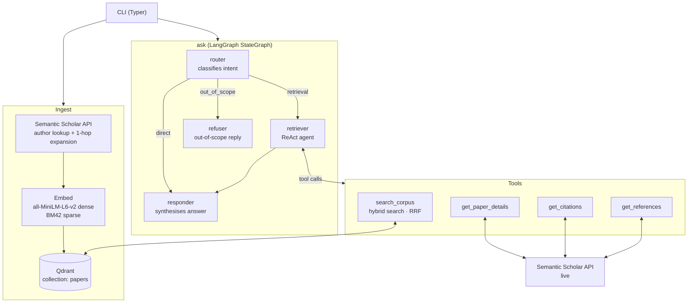
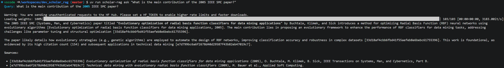
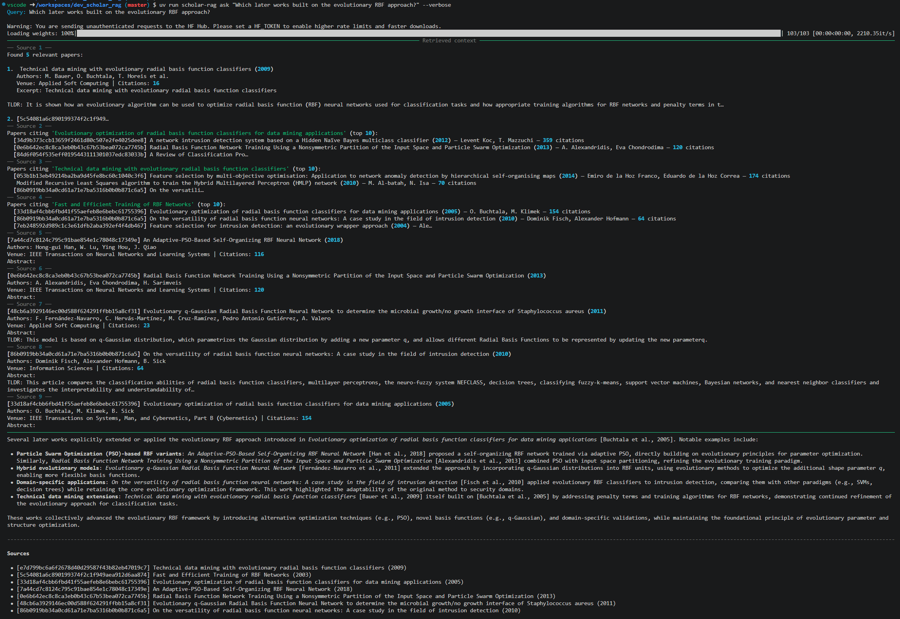
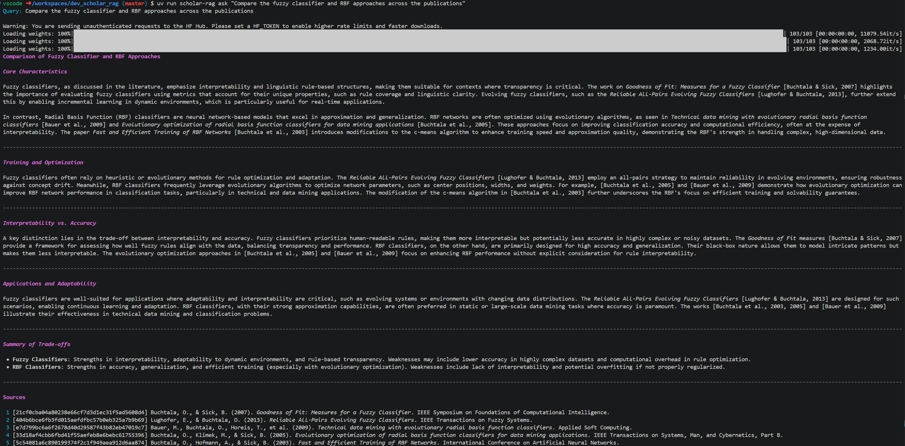
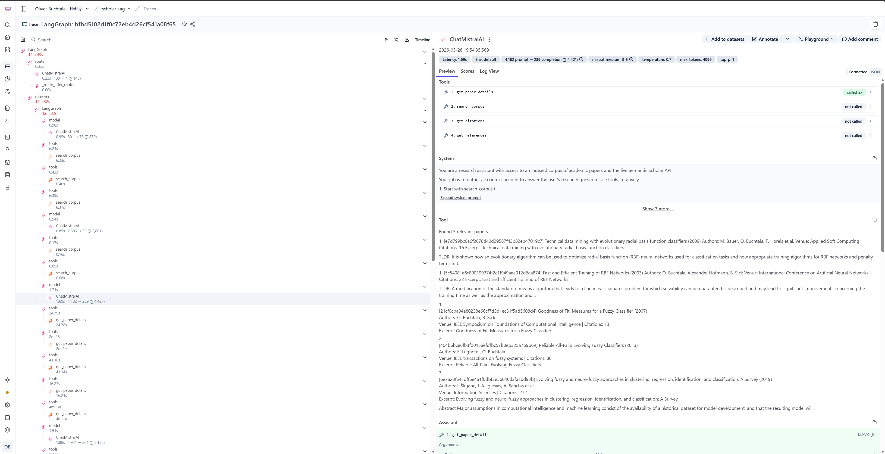

# scholar-rag

A multi-agent RAG system that explores and synthesises academic literature through live citation graph traversal, built with LangGraph, Qdrant, and Mistral.

The indexed corpus is the peer-reviewed publications of **Oliver Buchtala** (fuzzy systems, ML, pattern recognition — JKU Linz, 2001–2013), plus their first-hop references — all fetched at ingest time from the Semantic Scholar API. No PDFs required.

---

## Architecture



### How a query flows

1. **`router`** classifies intent with a single LLM call (`max_tokens=10`): `retrieval`, `direct`, or `out_of_scope`.
2. **`retriever`** runs a ReAct loop — calls tools iteratively until it has enough context.
3. **`responder`** synthesises the gathered context into a cited answer.
4. **`refuser`** short-circuits unrelated queries with a fixed message — no further LLM calls.

---

## Tech stack

| Layer | Choice | Notes |
|---|---|---|
| Agent orchestration | **LangGraph** | StateGraph with conditional routing |
| LLM | **Mistral Medium 3.5** | Via `langchain-mistralai`; swap via `LLM_MODEL` env var |
| Vector store | **Qdrant** | Hybrid search: dense + BM42 sparse |
| Dense embeddings | `all-MiniLM-L6-v2` | Local, 384-dim, no API cost |
| Sparse embeddings | BM42 via `fastembed` | Qdrant's attention-weighted keyword model |
| Data source | Semantic Scholar API | Abstracts, TLDRs, citation graph |
| Observability | **Langfuse Cloud** | Full trace per `ask` invocation (optional) |
| CLI | Typer | `ingest` / `ask` / `list-papers` |
| Package manager | uv | Fast, lockfile-based |
| Runtime | Python 3.12, Docker Compose | |

---

## Prerequisites

- **Docker Desktop** (runs Qdrant locally)
- **Mistral API key** — [console.mistral.ai](https://console.mistral.ai)
- **uv** — `pip install uv` (or see [astral.sh/uv](https://astral.sh/uv))
- Semantic Scholar API key — recommended for reliable corpus expansion; institutions and companies can request one at [semanticscholar.org/product/api](https://www.semanticscholar.org/product/api)
- Langfuse Cloud account — optional, free at [cloud.langfuse.com](https://cloud.langfuse.com) (for observability)

---

## Quick start

```bash
# 1. Clone and configure
git clone https://github.com/obuchtala/scholar-rag
cd scholar-rag
cp .env.example .env
# edit .env — set MISTRAL_API_KEY (required)
# optionally set LANGFUSE_PUBLIC_KEY / LANGFUSE_SECRET_KEY for tracing

# 2. Start Qdrant
docker compose up -d

# 3. Set up Python environment
uv venv .venv
uv pip install -e . --python .venv/bin/python

# 4. Ingest the corpus (~60 papers, takes 2–3 min)
uv run scholar-rag ingest

# 5. Ask questions
uv run scholar-rag ask "What are the main contributions of the evolutionary RBF classifier?"
```

### Via Docker Compose (production-style)

```bash
docker compose run app ingest
docker compose run app ask "Compare the fuzzy and RBF classification approaches"
```

The `app` service uses `QDRANT_URL=http://qdrant:6333` (compose network) automatically.

---

## Example queries

### 1 — Targeted paper lookup

```
$ uv run scholar-rag ask "What is the main contribution of the 2005 IEEE SMC paper?"
```



---

### 2 — Multi-hop citation traversal  *(demonstrates agentic tool use)*

```
$ uv run scholar-rag ask "Which later works built on the evolutionary RBF approach?"
```



This query triggered `search_corpus` → `get_citations` → `get_paper_details` — three tools, two live API hops beyond the local vector store.

---

### 3 — Cross-corpus synthesis

```
$ uv run scholar-rag ask "Compare the fuzzy classifier and RBF approaches across the publications"
```



---

## Project structure

```
scholar-rag/
├── src/scholar_rag/
│   ├── cli.py                  # ingest / ask / list-papers
│   ├── ingest.py               # Semantic Scholar → embed → Qdrant
│   ├── graph.py                # LangGraph StateGraph
│   ├── nodes/
│   │   ├── router.py           # intent classification (retrieval/direct/out_of_scope)
│   │   ├── retriever.py        # ReAct agent
│   │   ├── responder.py        # synthesis + citation formatting
│   │   └── refuser.py          # out-of-scope short-circuit
│   └── tools/
│       ├── qdrant_search.py    # hybrid search (dense + BM42 sparse, RRF)
│       └── semantic_scholar.py # get_paper_details / get_citations / get_references
├── tests/                      # 37 unit + 4 integration tests
├── doc/                        # deployment guide
├── docker-compose.yml          # Qdrant + app
├── Dockerfile                  # python:3.12-slim + uv
└── pyproject.toml              # uv-managed dependencies
```

---

## Running tests

```bash
uv pip install pytest pytest-asyncio pytest-mock --python .venv/bin/python
uv run pytest                   # 37 unit tests (no live connections needed)
uv run pytest -m integration    # 4 integration tests (requires live Qdrant + Mistral key)
```

All unit tests mock external services (Qdrant, Semantic Scholar API, Mistral) — no API keys or running containers needed.

---

## Observability

Every `ask` invocation is traced to [Langfuse Cloud](https://cloud.langfuse.com):

- One root trace per query
- Child spans per LangGraph node (`router`, `retriever`, `responder`)
- All tool calls captured (name, input, output, latency)
- Token counts and model logged per LLM call

Tracing is opt-in — set `LANGFUSE_PUBLIC_KEY` and `LANGFUSE_SECRET_KEY` in `.env` to enable.
If those keys are absent the graph runs normally with no tracing and no errors.



---

## Development environment

Developed in a VS Code devcontainer on a DigitalOcean droplet with persistent storage —
providing a consistent, isolated workspace across sessions.

Development was assisted by [Claude Code](https://claude.ai/code) throughout.

---

## About

Built by **Oliver Buchtala**.
The corpus intentionally uses Oliver's own publications, making it a live demonstration of
RAG over a domain the author knows deeply — useful for spotting hallucinations and evaluating answer quality.

- GitHub: [github.com/obuchtala](https://github.com/obuchtala)
- IBM Agentic AI & RAG Certificate, May 2026 (LangGraph, RAG pipelines, vector databases)
- Former Research Associate, JKU Linz (2009–2013)
